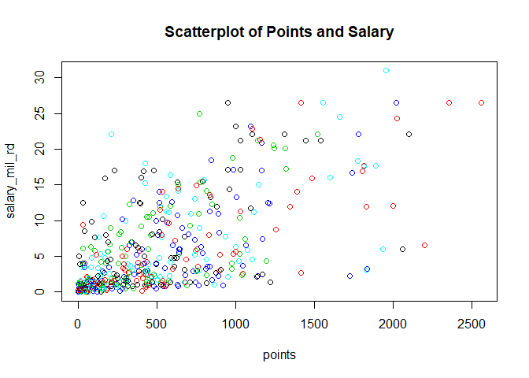
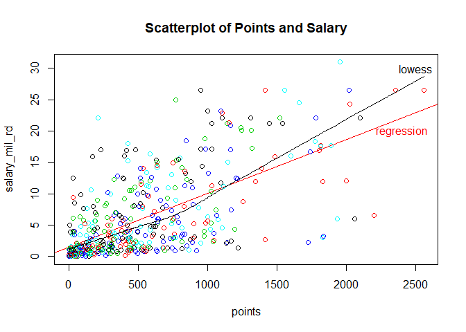
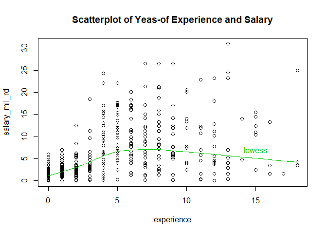
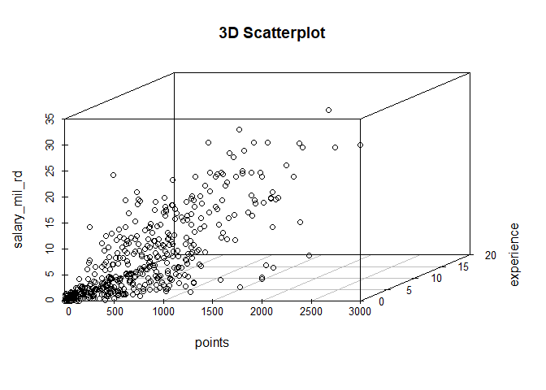
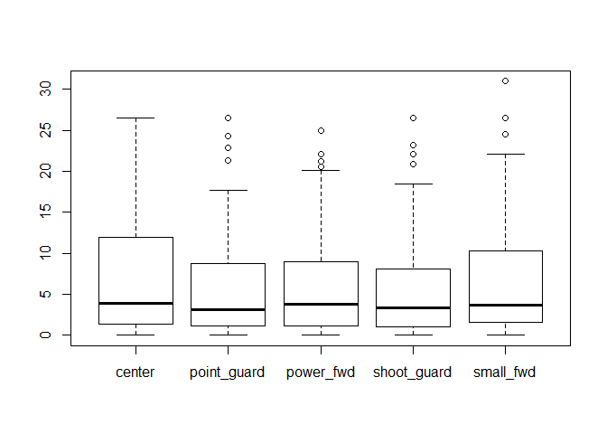

hw01-Josia-Yuan.Rmd
================
Josia Yuan
September 15, 2017

``` r
#load data file
load("data/nba2017-salary-points.RData")
#list the objects
ls()
```

    ## [1] "experience" "player"     "points"     "points1"    "points2"   
    ## [6] "points3"    "position"   "salary"     "team"

Research Questions
------------------

### 1\_ A bit of data preprocessing

#### 1\_01

``` r
#change salary units to million dollars
salary_mil <- salary/1000000
salary_mil_rd <- round(salary_mil, digits=2)
```

#### 1\_02

``` r
#replace R with 0 in vector experience
experience[experience == "R"] <- 0
#change experence to integer vector
experience <- as.integer(experience)
typeof(experience)
```

    ## [1] "integer"

#### 1\_03

``` r
#change descriptive labels for position
position[position == "C"] <- "center"
position[position == "SF"] <- "small_fwd"
position[position == "PF"] <- "power_fwd"
position[position == "SG"] <- "shoot_guard"
position[position == "PG"] <- "point_guard"
#change position to R factor
position_fac <- factor(position)
#table for frequency
table(position_fac)
```

    ## position_fac
    ##      center point_guard   power_fwd shoot_guard   small_fwd 
    ##          89          85          89          95          83

### 2\_Scatterplot of Points and Salary

``` r
#scatterplotfor points and salary
plot(points,salary_mil_rd,col=position_fac, main = "Scatterplot of Points and Salary")
```



### 3\_Correlation between Points and Salary

``` r
#create R objects
n <- length(salary_mil_rd)
x_sum <- sum(points)
y_sum <- sum(salary_mil_rd)
#mean of points and salary
x_mean <- x_sum/n
y_mean <- y_sum/n
#covariance of points and salary
a <- (points-x_mean)
b <- (salary_mil_rd-y_mean)
c <- a*b
sum(c)
```

    ## [1] 900426.8

``` r
cov_p_s <- sum(c)/(n-1)
#standard deviation of salary and points
var_x <- sum(a^2)/(n-1)
var_y <- sum(b^2)/(n-1)
sd_x <- sqrt(var_x)
sd_y <- sqrt(var_y)
#Correlation of salary and points
cor_p_s <- cov_p_s/(sd_x * sd_y)
```

### 4\_Simple Linear Reggression

#### 4\_01\_Create objects for:

. b1 the slope term . b0 the intercept term . Y^ the vector of predicted values ("y-hat")

``` r
#Obtain b1
b1 <- (cor_p_s * sd_y)/sd_x
#obtain b0
b0 <- y_mean - (b1 * x_mean)
#obtain Y_hat
Y_hat <- b0 + b1 * points
```

#### 4\_02\_Provide answers to the following questions:

``` r
#Summary statistics of Y_hat
summary(Y_hat)
```

    ##    Min. 1st Qu.  Median    Mean 3rd Qu.    Max. 
    ##   1.509   2.844   5.206   6.187   8.184  23.399

**Regression equation**
Salary = 1.5090766 + Points \* 0.0085576

**interpretation of slope coefficient b1**
The *slope coefficient* tells reader how much the response variable will change for each unit change in predictor variable.
In this specific case, b1=0.0085576 stands that for each unit point increase, salary increase by 0.0085576.

**interpretation of intercept b0**
The *intercept* represents the response variable when predictor variable is zero.
In this case, b0=1.5090766 stands that when value of point is 0, the corresponding player's salary is 1.5090766.

**What is the predicted salary for a player that scores:**
- 0 points?
- 100 points?
- 500 points?
- 1000 points?
- 2000 points?

``` r
salary_0 <- b0
salary_100 <- b0 + 100*b1
salary_500 <- b0 + 500*b1
salary_1000 <- b0 + 1000*b1
salary_2000 <- b0 + 2000*b1
```

### 5\_Plotting Regression Line

``` r
#add regression line
plot(points,salary_mil_rd,col=position_fac, main = "Scatterplot of Points and Salary", abline(a = b0, b = b1, col=2))
#add lowess line
lines(lowess(points, salary_mil_rd))
#add labels to each line
text(2500,30, "lowess")
text(2400, 20, "regression", col=2)
```



### 6\_Regression residuals and Coefficient of Determination R2

``` r
#vector of residuals
residuals <- c(salary_mil_rd-Y_hat)
summary(residuals)
```

    ##    Min. 1st Qu.  Median    Mean 3rd Qu.    Max. 
    ## -14.187  -2.792  -1.095   0.000   2.556  18.814

``` r
#RSS
RSS <- sum(residuals^2)
RSS
```

    ## [1] 11300.45

``` r
#TSS
TSS <- sum((salary_mil_rd-y_mean)^2)
TSS
```

    ## [1] 19005.91

``` r
#Coefficient of Determination R2
R_2 <- (1-(RSS/TSS))
R_2
```

    ## [1] 0.4054246

### 7\_ Exploring Position and Experience

#### 7\_01\_Scatterplot of Years-of-Experience and Salary

``` r
#scatterplot of experience and salary
plot(experience,salary_mil_rd, main = "Scatterplot of Yeas-of Experience and Salary")
#add lowess line
lines(lowess(experience, salary_mil_rd), col=3)
text(15, 7, "lowess", col=3)
```



#### Comments

The scatterplot shows that, with experience of 1 to 4 years, players' salaries are less spread-out compared to those with experience of more than 4 years, evident in the clustered points in each coloum. The lowess line also demonstrates a trend that, as experiences increase, corresponding salaries goes from a positive correlation to a negative one.
Players with 1-5 years of experience have relatively similar amount of salaries, while those with 5-10 years of experience are at their prime, receiving higher salaries and the amount is more spreadout. There are less players exceeding 10-13 years and going into 15 years or beyond. In this regards, years of experience do proide some implication for salaries.

#### 7\_02\_3D-scatterplot of Points, Experience, and Salary.

``` r
library("scatterplot3d")
scatterplot3d(points, experience, salary_mil_rd, main = "3D Scatterplot")
```



#### Comments

There is a denser cluster around the origin in the 3d-scatterplot. As points increase, salaries increase; while in the case of experience, the positive correlation is not so consistent, as noted in comments for 2d-scatterplot of Yeas-of Experience and Salary.

#### 7\_03\_Conditional boxplot of Salary in terms of Position

``` r
boxplot(salary_mil_rd ~ position_fac)
```



#### Comments

For each position, median salary is similar. While positions other than the "Center" have some outliers, "Center" shows more variabilities with its larger range (0-around 26 millions) and spread.Therefore I conclude that positions can't give much implications about players' salaries.

### 8\_ Comments and Reflections

The homework is hard in the sense that I lack practices and it took me a while to get used to the thinking-process. Using simple mathematical formulas for calculations were easy, while creating and customizing plots were realtivel harder because they are less intuitive.
As for Github, it is my first time using it, and it took some time for me to familiarize myself with the logic and shortcuts.But I found it very useful.
