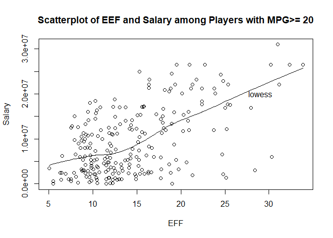

hw02-Josia-Yuan
================
Josia Yuan
September 28, 2017

2)Importing Data
----------------

``` r
#importing using read.csv
cls = c("character","character","factor","character","double")
t = rep("integer",19)
cls = c(cls,t)
dat <- read.csv('../hw02/data/nba2017-player-statistics.csv', stringsAsFactors = FALSE, colClasses = cls)
str(dat)
```

    ## 'data.frame':    441 obs. of  24 variables:
    ##  $ Player      : chr  "Al Horford" "Amir Johnson" "Avery Bradley" "Demetrius Jackson" ...
    ##  $ Team        : chr  "BOS" "BOS" "BOS" "BOS" ...
    ##  $ Position    : Factor w/ 5 levels "C","PF","PG",..: 1 2 5 3 4 3 4 5 4 2 ...
    ##  $ Experience  : chr  "9" "11" "6" "R" ...
    ##  $ Salary      : num  26540100 12000000 8269663 1450000 1410598 ...
    ##  $ Rank        : int  4 6 5 15 11 1 3 13 8 10 ...
    ##  $ Age         : int  30 29 26 22 31 27 26 21 20 29 ...
    ##  $ GP          : int  68 80 55 5 47 76 72 29 78 78 ...
    ##  $ GS          : int  68 77 55 0 0 76 72 0 20 6 ...
    ##  $ MIN         : int  2193 1608 1835 17 538 2569 2335 220 1341 1232 ...
    ##  $ FGM         : int  379 213 359 3 95 682 333 25 192 114 ...
    ##  $ FGA         : int  801 370 775 4 232 1473 720 58 423 262 ...
    ##  $ Points3     : int  86 27 108 1 39 245 157 12 46 45 ...
    ##  $ Points3_atts: int  242 66 277 1 111 646 394 35 135 130 ...
    ##  $ Points2     : int  293 186 251 2 56 437 176 13 146 69 ...
    ##  $ Points2_atts: int  559 304 498 3 121 827 326 23 288 132 ...
    ##  $ FTM         : int  108 67 68 3 33 590 176 6 85 26 ...
    ##  $ FTA         : int  135 100 93 6 41 649 217 9 124 37 ...
    ##  $ OREB        : int  95 117 65 2 17 43 48 6 45 60 ...
    ##  $ DREB        : int  369 248 269 2 68 162 367 20 175 213 ...
    ##  $ AST         : int  337 140 121 3 33 449 155 4 64 71 ...
    ##  $ STL         : int  52 52 68 0 9 70 72 10 35 26 ...
    ##  $ BLK         : int  87 62 11 0 7 13 23 2 18 17 ...
    ##  $ TO          : int  116 77 88 0 25 210 79 4 68 39 ...

``` r
head(dat)
```

| Player            | Team | Position | Experience |    Salary|  Rank|  Age|   GP|   GS|   MIN|  FGM|   FGA|  Points3|  Points3\_atts|  Points2|  Points2\_atts|  FTM|  FTA|  OREB|  DREB|  AST|  STL|  BLK|   TO|
|:------------------|:-----|:---------|:-----------|---------:|-----:|----:|----:|----:|-----:|----:|-----:|--------:|--------------:|--------:|--------------:|----:|----:|-----:|-----:|----:|----:|----:|----:|
| Al Horford        | BOS  | C        | 9          |  26540100|     4|   30|   68|   68|  2193|  379|   801|       86|            242|      293|            559|  108|  135|    95|   369|  337|   52|   87|  116|
| Amir Johnson      | BOS  | PF       | 11         |  12000000|     6|   29|   80|   77|  1608|  213|   370|       27|             66|      186|            304|   67|  100|   117|   248|  140|   52|   62|   77|
| Avery Bradley     | BOS  | SG       | 6          |   8269663|     5|   26|   55|   55|  1835|  359|   775|      108|            277|      251|            498|   68|   93|    65|   269|  121|   68|   11|   88|
| Demetrius Jackson | BOS  | PG       | R          |   1450000|    15|   22|    5|    0|    17|    3|     4|        1|              1|        2|              3|    3|    6|     2|     2|    3|    0|    0|    0|
| Gerald Green      | BOS  | SF       | 9          |   1410598|    11|   31|   47|    0|   538|   95|   232|       39|            111|       56|            121|   33|   41|    17|    68|   33|    9|    7|   25|
| Isaiah Thomas     | BOS  | PG       | 5          |   6587132|     1|   27|   76|   76|  2569|  682|  1473|      245|            646|      437|            827|  590|  649|    43|   162|  449|   70|   13|  210|

``` r
typeof(dat$Salary)
```

    ## [1] "double"

``` r
class(dat$Position)
```

    ## [1] "factor"

``` r
class(dat$Experience)
```

    ## [1] "character"

``` r
#imporiting using read_cvs9
clt = list(col_character(),col_character(),col_character(),col_character(),col_double(), col_integer(), col_integer(),col_integer(),col_integer(), col_integer(), col_integer(),col_integer(),col_integer(), col_integer(), col_integer(),col_integer(),col_integer(), col_integer(), col_integer(),col_integer(),col_integer(), col_integer(), col_integer(),col_integer())
dat1 <- read_csv('../hw02/data/nba2017-player-statistics.csv', col_types = clt)
dat1$Position <- as.factor(dat1$Position)
str(dat1)
```

    ## Classes 'tbl_df', 'tbl' and 'data.frame':    441 obs. of  24 variables:
    ##  $ Player      : chr  "Al Horford" "Amir Johnson" "Avery Bradley" "Demetrius Jackson" ...
    ##  $ Team        : chr  "BOS" "BOS" "BOS" "BOS" ...
    ##  $ Position    : Factor w/ 5 levels "C","PF","PG",..: 1 2 5 3 4 3 4 5 4 2 ...
    ##  $ Experience  : chr  "9" "11" "6" "R" ...
    ##  $ Salary      : num  26540100 12000000 8269663 1450000 1410598 ...
    ##  $ Rank        : int  4 6 5 15 11 1 3 13 8 10 ...
    ##  $ Age         : int  30 29 26 22 31 27 26 21 20 29 ...
    ##  $ GP          : int  68 80 55 5 47 76 72 29 78 78 ...
    ##  $ GS          : int  68 77 55 0 0 76 72 0 20 6 ...
    ##  $ MIN         : int  2193 1608 1835 17 538 2569 2335 220 1341 1232 ...
    ##  $ FGM         : int  379 213 359 3 95 682 333 25 192 114 ...
    ##  $ FGA         : int  801 370 775 4 232 1473 720 58 423 262 ...
    ##  $ Points3     : int  86 27 108 1 39 245 157 12 46 45 ...
    ##  $ Points3_atts: int  242 66 277 1 111 646 394 35 135 130 ...
    ##  $ Points2     : int  293 186 251 2 56 437 176 13 146 69 ...
    ##  $ Points2_atts: int  559 304 498 3 121 827 326 23 288 132 ...
    ##  $ FTM         : int  108 67 68 3 33 590 176 6 85 26 ...
    ##  $ FTA         : int  135 100 93 6 41 649 217 9 124 37 ...
    ##  $ OREB        : int  95 117 65 2 17 43 48 6 45 60 ...
    ##  $ DREB        : int  369 248 269 2 68 162 367 20 175 213 ...
    ##  $ AST         : int  337 140 121 3 33 449 155 4 64 71 ...
    ##  $ STL         : int  52 52 68 0 9 70 72 10 35 26 ...
    ##  $ BLK         : int  87 62 11 0 7 13 23 2 18 17 ...
    ##  $ TO          : int  116 77 88 0 25 210 79 4 68 39 ...
    ##  - attr(*, "spec")=List of 2
    ##   ..$ cols   :List of 24
    ##   .. ..$ Player      : list()
    ##   .. .. ..- attr(*, "class")= chr  "collector_character" "collector"
    ##   .. ..$ Team        : list()
    ##   .. .. ..- attr(*, "class")= chr  "collector_character" "collector"
    ##   .. ..$ Position    : list()
    ##   .. .. ..- attr(*, "class")= chr  "collector_character" "collector"
    ##   .. ..$ Experience  : list()
    ##   .. .. ..- attr(*, "class")= chr  "collector_character" "collector"
    ##   .. ..$ Salary      : list()
    ##   .. .. ..- attr(*, "class")= chr  "collector_double" "collector"
    ##   .. ..$ Rank        : list()
    ##   .. .. ..- attr(*, "class")= chr  "collector_integer" "collector"
    ##   .. ..$ Age         : list()
    ##   .. .. ..- attr(*, "class")= chr  "collector_integer" "collector"
    ##   .. ..$ GP          : list()
    ##   .. .. ..- attr(*, "class")= chr  "collector_integer" "collector"
    ##   .. ..$ GS          : list()
    ##   .. .. ..- attr(*, "class")= chr  "collector_integer" "collector"
    ##   .. ..$ MIN         : list()
    ##   .. .. ..- attr(*, "class")= chr  "collector_integer" "collector"
    ##   .. ..$ FGM         : list()
    ##   .. .. ..- attr(*, "class")= chr  "collector_integer" "collector"
    ##   .. ..$ FGA         : list()
    ##   .. .. ..- attr(*, "class")= chr  "collector_integer" "collector"
    ##   .. ..$ Points3     : list()
    ##   .. .. ..- attr(*, "class")= chr  "collector_integer" "collector"
    ##   .. ..$ Points3_atts: list()
    ##   .. .. ..- attr(*, "class")= chr  "collector_integer" "collector"
    ##   .. ..$ Points2     : list()
    ##   .. .. ..- attr(*, "class")= chr  "collector_integer" "collector"
    ##   .. ..$ Points2_atts: list()
    ##   .. .. ..- attr(*, "class")= chr  "collector_integer" "collector"
    ##   .. ..$ FTM         : list()
    ##   .. .. ..- attr(*, "class")= chr  "collector_integer" "collector"
    ##   .. ..$ FTA         : list()
    ##   .. .. ..- attr(*, "class")= chr  "collector_integer" "collector"
    ##   .. ..$ OREB        : list()
    ##   .. .. ..- attr(*, "class")= chr  "collector_integer" "collector"
    ##   .. ..$ DREB        : list()
    ##   .. .. ..- attr(*, "class")= chr  "collector_integer" "collector"
    ##   .. ..$ AST         : list()
    ##   .. .. ..- attr(*, "class")= chr  "collector_integer" "collector"
    ##   .. ..$ STL         : list()
    ##   .. .. ..- attr(*, "class")= chr  "collector_integer" "collector"
    ##   .. ..$ BLK         : list()
    ##   .. .. ..- attr(*, "class")= chr  "collector_integer" "collector"
    ##   .. ..$ TO          : list()
    ##   .. .. ..- attr(*, "class")= chr  "collector_integer" "collector"
    ##   ..$ default: list()
    ##   .. ..- attr(*, "class")= chr  "collector_guess" "collector"
    ##   ..- attr(*, "class")= chr "col_spec"

``` r
class(dat1$Position)
```

    ## [1] "factor"

``` r
typeof(dat$Salary)
```

    ## [1] "double"

3)Right after importing data
----------------------------

``` r
#convert R to 0 in Experience
typeof(dat$Experience)
```

    ## [1] "character"

``` r
dat$Experience[dat$Experience == "R"] <- 0
dat$Experience <- as.integer(dat$Experience)
typeof(dat$Experience)
```

    ## [1] "integer"

4)Performance of Players
------------------------

``` r
#Create variables needed for EFF
dat$Missed_FG <- dat$FGA-dat$FGM
dat$Missed_FT <- dat$FTA-dat$FTM
dat$PTS <- (dat$Points2 * 2)+(dat$Points3 * 3)+dat$FTM
dat$REB <- dat$OREB + dat$DREB
dat$MPG <- dat$MIN/dat$GP
head(dat,5)
```

| Player            | Team | Position |  Experience|    Salary|  Rank|  Age|   GP|   GS|   MIN|  FGM|  FGA|  Points3|  Points3\_atts|  Points2|  Points2\_atts|  FTM|  FTA|  OREB|  DREB|  AST|  STL|  BLK|   TO|  Missed\_FG|  Missed\_FT|  PTS|  REB|       MPG|
|:------------------|:-----|:---------|-----------:|---------:|-----:|----:|----:|----:|-----:|----:|----:|--------:|--------------:|--------:|--------------:|----:|----:|-----:|-----:|----:|----:|----:|----:|-----------:|-----------:|----:|----:|---------:|
| Al Horford        | BOS  | C        |           9|  26540100|     4|   30|   68|   68|  2193|  379|  801|       86|            242|      293|            559|  108|  135|    95|   369|  337|   52|   87|  116|         422|          27|  952|  464|  32.25000|
| Amir Johnson      | BOS  | PF       |          11|  12000000|     6|   29|   80|   77|  1608|  213|  370|       27|             66|      186|            304|   67|  100|   117|   248|  140|   52|   62|   77|         157|          33|  520|  365|  20.10000|
| Avery Bradley     | BOS  | SG       |           6|   8269663|     5|   26|   55|   55|  1835|  359|  775|      108|            277|      251|            498|   68|   93|    65|   269|  121|   68|   11|   88|         416|          25|  894|  334|  33.36364|
| Demetrius Jackson | BOS  | PG       |           0|   1450000|    15|   22|    5|    0|    17|    3|    4|        1|              1|        2|              3|    3|    6|     2|     2|    3|    0|    0|    0|           1|           3|   10|    4|   3.40000|
| Gerald Green      | BOS  | SF       |           9|   1410598|    11|   31|   47|    0|   538|   95|  232|       39|            111|       56|            121|   33|   41|    17|    68|   33|    9|    7|   25|         137|           8|  262|   85|  11.44681|

``` r
#Calculate EFF
dat$EFF <- (dat$PTS + dat$REB + dat$AST + dat$STL + dat$BLK - dat$Missed_FG - dat$Missed_FT - dat$TO)/dat$GP
head(dat,5)
```

| Player            | Team | Position |  Experience|    Salary|  Rank|  Age|   GP|   GS|   MIN|  FGM|  FGA|  Points3|  Points3\_atts|  Points2|  Points2\_atts|  FTM|  FTA|  OREB|  DREB|  AST|  STL|  BLK|   TO|  Missed\_FG|  Missed\_FT|  PTS|  REB|       MPG|        EFF|
|:------------------|:-----|:---------|-----------:|---------:|-----:|----:|----:|----:|-----:|----:|----:|--------:|--------------:|--------:|--------------:|----:|----:|-----:|-----:|----:|----:|----:|----:|-----------:|-----------:|----:|----:|---------:|----------:|
| Al Horford        | BOS  | C        |           9|  26540100|     4|   30|   68|   68|  2193|  379|  801|       86|            242|      293|            559|  108|  135|    95|   369|  337|   52|   87|  116|         422|          27|  952|  464|  32.25000|  19.514706|
| Amir Johnson      | BOS  | PF       |          11|  12000000|     6|   29|   80|   77|  1608|  213|  370|       27|             66|      186|            304|   67|  100|   117|   248|  140|   52|   62|   77|         157|          33|  520|  365|  20.10000|  10.900000|
| Avery Bradley     | BOS  | SG       |           6|   8269663|     5|   26|   55|   55|  1835|  359|  775|      108|            277|      251|            498|   68|   93|    65|   269|  121|   68|   11|   88|         416|          25|  894|  334|  33.36364|  16.345454|
| Demetrius Jackson | BOS  | PG       |           0|   1450000|    15|   22|    5|    0|    17|    3|    4|        1|              1|        2|              3|    3|    6|     2|     2|    3|    0|    0|    0|           1|           3|   10|    4|   3.40000|   2.600000|
| Gerald Green      | BOS  | SF       |           9|   1410598|    11|   31|   47|    0|   538|   95|  232|       39|            111|       56|            121|   33|   41|    17|    68|   33|    9|    7|   25|         137|           8|  262|   85|  11.44681|   4.808511|

``` r
summary(dat$EFF)
```

|  Min.|   1st Qu.|    Median|      Mean|   3rd Qu.|      Max.|
|-----:|---------:|---------:|---------:|---------:|---------:|
|  -0.6|  5.451613|  9.089552|  10.13654|  13.24675|  33.83951|

``` r
hist(dat$EFF, main='Histogram of Efficiency(EFF)', xlab='EFF')
```


``` r
#display info of top-10 players by EFF in decreasing order in data frame
top_10 <- arrange(dat,desc(dat$EFF))
head(top_10,10)
```

| Player                | Team | Position |  Experience|    Salary|  Rank|  Age|   GP|   GS|   MIN|  FGM|   FGA|  Points3|  Points3\_atts|  Points2|  Points2\_atts|  FTM|  FTA|  OREB|  DREB|  AST|  STL|  BLK|   TO|  Missed\_FG|  Missed\_FT|   PTS|   REB|       MPG|       EFF|
|:----------------------|:-----|:---------|-----------:|---------:|-----:|----:|----:|----:|-----:|----:|-----:|--------:|--------------:|--------:|--------------:|----:|----:|-----:|-----:|----:|----:|----:|----:|-----------:|-----------:|-----:|-----:|---------:|---------:|
| Russell Westbrook     | OKC  | PG       |           8|  26540100|     1|   28|   81|   81|  2802|  824|  1941|      200|            583|      624|           1358|  710|  840|   137|   727|  840|  133|   31|  438|        1117|         130|  2558|   864|  34.59259|  33.83951|
| James Harden          | HOU  | PG       |           7|  26540100|     1|   27|   81|   81|  2947|  674|  1533|      262|            756|      412|            777|  746|  881|    95|   564|  906|  120|   37|  464|         859|         135|  2356|   659|  36.38272|  32.34568|
| Anthony Davis         | NOP  | C        |           4|  22116750|     1|   23|   75|   75|  2708|  770|  1527|       40|            134|      730|           1393|  519|  647|   174|   712|  157|   94|  167|  181|         757|         128|  2099|   886|  36.10667|  31.16000|
| LeBron James          | CLE  | SF       |          13|  30963450|     1|   32|   74|   74|  2794|  736|  1344|      124|            342|      612|           1002|  358|  531|    97|   543|  646|   92|   44|  303|         608|         173|  1954|   640|  37.75676|  30.97297|
| Karl-Anthony Towns    | MIN  | C        |           1|   5960160|     2|   21|   82|   82|  3030|  802|  1479|      101|            275|      701|           1204|  356|  428|   296|   711|  220|   57|  103|  212|         677|          72|  2061|  1007|  36.95122|  30.32927|
| Kevin Durant          | GSW  | SF       |           9|  26540100|     4|   28|   62|   62|  2070|  551|  1026|      117|            312|      434|            714|  336|  384|    39|   474|  300|   66|   99|  138|         475|          48|  1555|   513|  33.38710|  30.19355|
| Giannis Antetokounmpo | MIL  | SF       |           3|   2995421|     1|   22|   80|   80|  2845|  656|  1259|       49|            180|      607|           1079|  471|  612|   142|   558|  434|  131|  151|  234|         603|         141|  1832|   700|  35.56250|  28.37500|
| DeMarcus Cousins      | NOP  | C        |           6|  16957900|    11|   26|   17|   17|   574|  142|   314|       36|             96|      106|            218|   94|  121|    38|   174|   66|   25|   19|   62|         172|          27|   414|   212|  33.76471|  27.94118|
| Jimmy Butler          | CHI  | SF       |           5|  17552209|     1|   27|   76|   75|  2809|  570|  1252|       91|            248|      479|           1004|  585|  676|   128|   342|  417|  143|   32|  159|         682|          91|  1816|   470|  36.96053|  25.60526|
| Hassan Whiteside      | MIA  | C        |           4|  22116750|     1|   27|   77|   77|  2513|  542|   973|        0|              0|      542|            973|  225|  358|   293|   795|   57|   56|  161|  154|         431|         133|  1309|  1088|  32.63636|  25.36364|

``` r
#Names of Players with negative EFF
dat[dat$EFF<0,1]
```

    ## [1] "Patricio Garino"

``` r
#compute correlation coefficients between EFF and other variables
a<-cor(dat$EFF, dat$PTS)
b<-cor(dat$EFF, dat$REB)
c<-cor(dat$EFF, dat$AST)
d<-cor(dat$EFF, dat$STL)
e<-cor(dat$EFF,dat$BLK)
f<-cor(dat$EFF,dat$Missed_FG)*(-1)
g<-cor(dat$EFF,dat$Missed_FT)*(-1)
h<-cor(dat$EFF,dat$TO)*(-1)
i<-cor(dat$EFF,dat$GP)
#Display cc in descending order
Cor_Coe <- c(a,b,c,d,e,f,g,h,i)
variables <- c('PTS','REB','AST','STL','BLK','MFG','MFT','TO','GP')
R <- data.frame(Variable_with_EFF = variables,
           Correlation_Coefficient = Cor_Coe)
R[order(R$Correlation_Coefficient,decreasing = TRUE),]
```

|     | Variable\_with\_EFF |  Correlation\_Coefficient|
|-----|:--------------------|-------------------------:|
| 1   | PTS                 |                 0.8588644|
| 2   | REB                 |                 0.7634501|
| 4   | STL                 |                 0.6957286|
| 3   | AST                 |                 0.6689232|
| 5   | BLK                 |                 0.5679571|
| 9   | GP                  |                 0.4773648|
| 7   | MFT                 |                -0.7271456|
| 6   | MFG                 |                -0.7722477|
| 8   | TO                  |                -0.8003289|

``` r
arrange(R,desc(Correlation_Coefficient))
```

| Variable\_with\_EFF |  Correlation\_Coefficient|
|:--------------------|-------------------------:|
| PTS                 |                 0.8588644|
| REB                 |                 0.7634501|
| STL                 |                 0.6957286|
| AST                 |                 0.6689232|
| BLK                 |                 0.5679571|
| GP                  |                 0.4773648|
| MFT                 |                -0.7271456|
| MFG                 |                -0.7722477|
| TO                  |                -0.8003289|

``` r
#barchart
barplot(R$Correlation_Coefficient, main = 'Correlations between Player Stats and EFF', names.arg = variables)
```


5)Efficiency and Salary
-----------------------

``` r
#scatterplot
plot(dat$EFF,dat$Salary, main='Scatterplot of Efficiency and Salary',xlab='EFF',ylab='Salary')
lines(lowess(dat$EFF,dat$Salary))
text(28,2.5*10^7,'lowess')
```


``` r
#correlation coefficient
cor(dat$EFF,dat$Salary)
```

    ## [1] 0.655624

### Comment:

With a correlation coefficient **0.655624**,the Efficiency of a player doesn't seem to have that strong a correlation with salary.Yet it can still be seen from the scatterplot that a positive correlation is noticable.

``` r
#select players with MPG>=20
players2<-data.frame(dat[dat$MPG>=20,])
head(players2)
```

|     | Player        | Team | Position |  Experience|    Salary|  Rank|  Age|   GP|   GS|   MIN|  FGM|   FGA|  Points3|  Points3\_atts|  Points2|  Points2\_atts|  FTM|  FTA|  OREB|  DREB|  AST|  STL|  BLK|   TO|  Missed\_FG|  Missed\_FT|   PTS|  REB|       MPG|       EFF|
|-----|:--------------|:-----|:---------|-----------:|---------:|-----:|----:|----:|----:|-----:|----:|-----:|--------:|--------------:|--------:|--------------:|----:|----:|-----:|-----:|----:|----:|----:|----:|-----------:|-----------:|-----:|----:|---------:|---------:|
| 1   | Al Horford    | BOS  | C        |           9|  26540100|     4|   30|   68|   68|  2193|  379|   801|       86|            242|      293|            559|  108|  135|    95|   369|  337|   52|   87|  116|         422|          27|   952|  464|  32.25000|  19.51471|
| 2   | Amir Johnson  | BOS  | PF       |          11|  12000000|     6|   29|   80|   77|  1608|  213|   370|       27|             66|      186|            304|   67|  100|   117|   248|  140|   52|   62|   77|         157|          33|   520|  365|  20.10000|  10.90000|
| 3   | Avery Bradley | BOS  | SG       |           6|   8269663|     5|   26|   55|   55|  1835|  359|   775|      108|            277|      251|            498|   68|   93|    65|   269|  121|   68|   11|   88|         416|          25|   894|  334|  33.36364|  16.34545|
| 6   | Isaiah Thomas | BOS  | PG       |           5|   6587132|     1|   27|   76|   76|  2569|  682|  1473|      245|            646|      437|            827|  590|  649|    43|   162|  449|   70|   13|  210|         791|          59|  2199|  205|  33.80263|  24.68421|
| 7   | Jae Crowder   | BOS  | SF       |           4|   6286408|     3|   26|   72|   72|  2335|  333|   720|      157|            394|      176|            326|  176|  217|    48|   367|  155|   72|   23|   79|         387|          41|   999|  415|  32.43056|  16.06944|
| 12  | Kelly Olynyk  | BOS  | C        |           3|   3094014|     7|   25|   75|    6|  1538|  260|   508|       68|            192|      192|            316|   90|  123|    72|   288|  148|   43|   29|   96|         248|          33|   678|  360|  20.50667|  11.74667|

``` r
#scatterplot between EFF and Salary
plot(players2$EFF,players2$Salary,main='Scatterplot of EEF and Salary among Players with MPG>= 20',xlab='EFF',ylab='Salary')
lines(lowess(players2$EFF,players2$Salary))
text(29,2*10^7,'lowess')
```



``` r
#correlation coefficient
cor(players2$EFF,players2$Salary)
```

    ## [1] 0.5367224

### Comments

With a correlation coefficient **0.5367224**,the Efficiency of "more established" player has an weaker correaltion with salary than that in general. As it can be seen from the scatterplot, points show a tendency of floting around, and the lowess line is less of a stright or soooth one.

6)Comments and Reflection
-------------------------

Since I'm more familiar with differet functions and arguments used in manipulating data frames, the assignment this time is not as confusing as the first homework. However, I still find it worrisome that I always have to remember to use different sytax for different functions, even though the functions may have the same outcomes.
