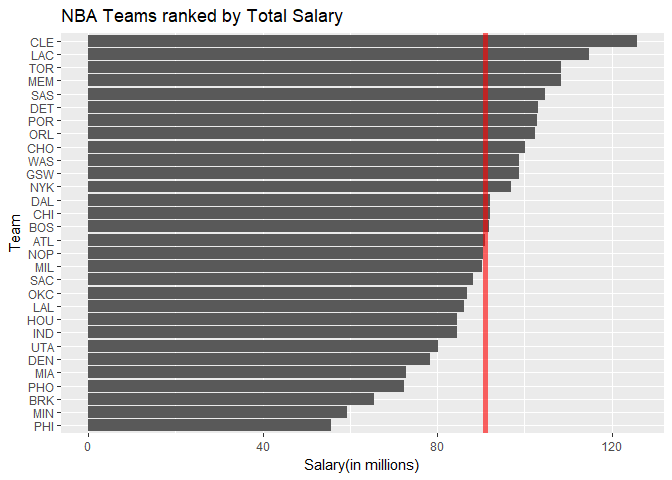
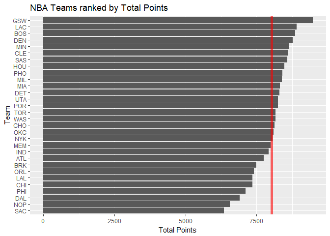
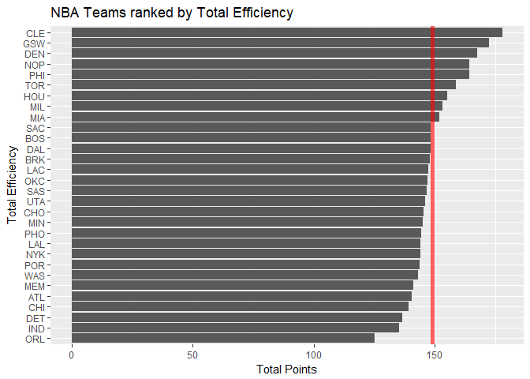
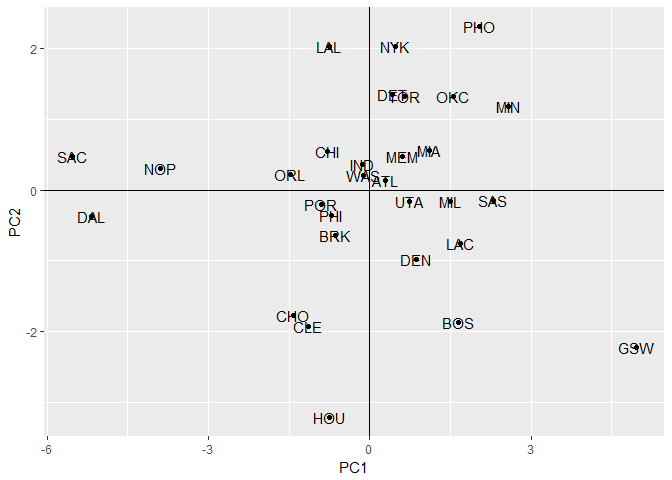
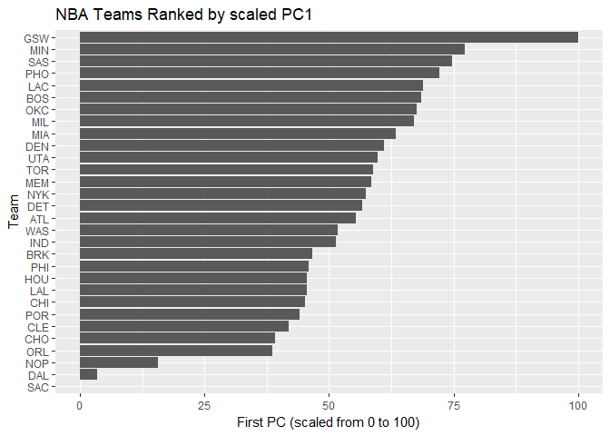

hw03-josia-yuan
================
Josia Yuan
October 6, 2017

### Basic Rankings

``` r
teams_data <-read.csv('../data/nba2017-teams.csv', stringsAsFactors = FALSE)
```

``` r
#Barplot for salary in teams
a <- ggplot(data = teams_data,aes(x = reorder(team, salary), y = salary)) +
  geom_bar(stat='identity') +
  coord_flip()
a<-a+labs(title='NBA Teams ranked by Total Salary')
a<-a+labs(y='Salary(in millions)',x='Team')
mean(teams_data$salary)
```

    ## [1] 90.94933

``` r
a<-a+geom_hline(yintercept =90.94933,col=2,size=2,alpha=0.6)
a
```



``` r
#Comments: While Cle has the highest total salary, Phi has the lowest one.

#Barplot for points in teams
b <- ggplot(data =teams_data, aes(x=reorder(team, points), y = points)) +
  geom_bar(stat='identity') +
  coord_flip()
b<-b+labs(title='NBA Teams ranked by Total Points')
b<-b+labs(y='Total Points',x='Team')
mean(teams_data$points)
```

    ## [1] 8035.1

``` r
b<-b+geom_hline(yintercept =8035.1,col=2,size=2,alpha=0.6)
b
```



``` r
#Comments: While Gsw has the highest total points, Sac has the lowest one.

#Barplot for efficiency in teams
c <- ggplot(data = teams_data,aes(x = reorder(team, efficiency), y = efficiency)) +
  geom_bar(stat='identity') +
  coord_flip()
c<-c+labs(title='NBA Teams ranked by Total Efficiency')
c<-c+labs(y='Total Points',x='Total Efficiency')
mean(teams_data$efficiency)
```

    ## [1] 149.0072

``` r
c<-c+geom_hline(yintercept =149.0072,col=2,size=2,alpha=0.6)
c
```



``` r
#Comments: while Cle has the highest total efficiency, Orl has the lowest one, much lower than the second lowest team Ind.
```

### Principal Components Analysis (PCA):

``` r
pca<-select(teams_data, points3,points2,free_throws,off_rebounds,def_rebounds,assists,steals,blocks,turnovers,fouls)
pca1<-prcomp(pca,scale=TRUE)
names(pca1)
```

    ## [1] "sdev"     "rotation" "center"   "scale"    "x"

``` r
eig <- data.frame(eigenvalue = round(pca1$sdev^2, 4), 
                   prop = round(pca1$sdev^2 / sum(pca1$sdev^2), 4))
eig <- mutate(eig, cumprop = cumsum(eig$prop))
eig
```

    ##    eigenvalue   prop cumprop
    ## 1      4.6959 0.4696  0.4696
    ## 2      1.7020 0.1702  0.6398
    ## 3      0.9795 0.0980  0.7378
    ## 4      0.7717 0.0772  0.8150
    ## 5      0.5341 0.0534  0.8684
    ## 6      0.4780 0.0478  0.9162
    ## 7      0.3822 0.0382  0.9544
    ## 8      0.2603 0.0260  0.9804
    ## 9      0.1336 0.0134  0.9938
    ## 10     0.0627 0.0063  1.0001

``` r
pca2<-as.data.frame(pca1$x)
ggplot(data=pca2,aes(x=PC1,y=PC2))+geom_point()+geom_text(label=teams_data$team)+geom_hline(yintercept = 0) + geom_vline(xintercept = 0)
```



``` r
#Index based on PC1
s1 <- 100 * ((pca2$PC1 - min(pca2$PC1)) / (max(pca2$PC1) - min(pca2$PC1)))
ggplot(data = teams_data, aes(x = reorder(team, s1), y = s1)) + 
  geom_bar(stat = 'identity') + 
  coord_flip() + 
  labs(x = 'Team', y = 'First PC (scaled from 0 to 100)') + 
  ggtitle('NBA Teams Ranked by scaled PC1')
```



### Comments and Reflections

The PCA feels a bit confusing to me in the sense that I can do the computation but I don't understand the intuition behind it. Other than that, I think the homework is a good mini-comprehensive practice for all we have covered so far.
